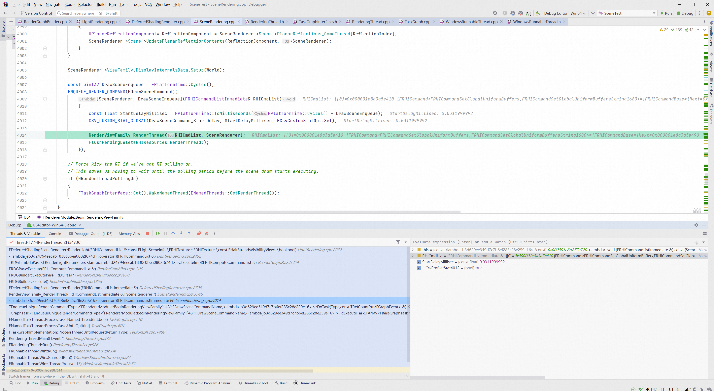
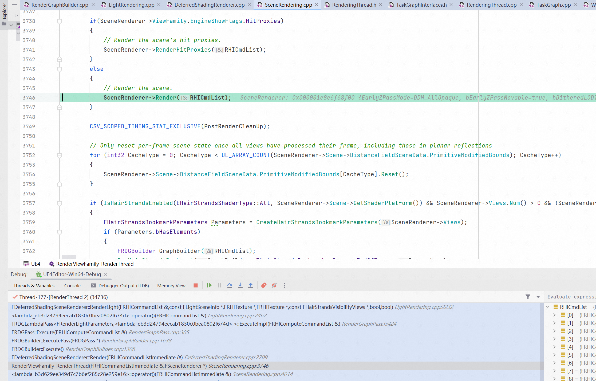
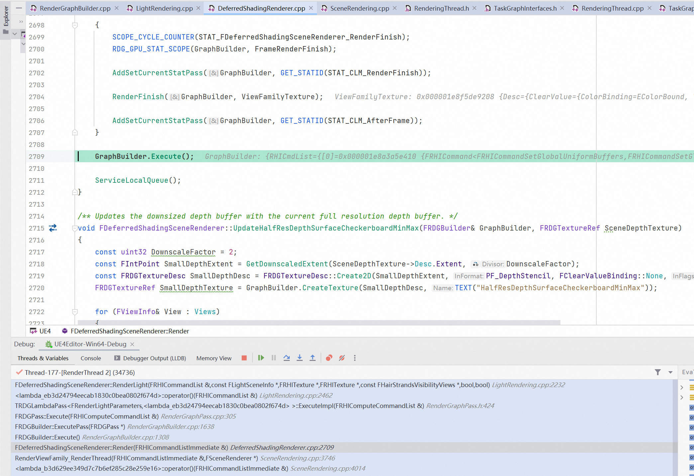

1. 在没有Indirect Draw之前，应用程序如果想要实现同一个Draw Call绘制多个物体，只能使用GPU Instance，但是GPU Instance有非常多的限制，比如需要完全一样的顶点、索引、渲染状态和材质数据，只允许Transform不一样。即使贴图可以打包Atlas，材质属性和模型网格可以打包StructuredBuffer，也没法避免每次绘制时顶点数必须一样这一个致命的限制，想要实现GPU Driven Rendering Pipeline必须打碎成相同顶点数的Cluster。一般来说一个Cluster对应64个顶点，这样能保证一个线程负责一个顶点的处理。但是这是如何对应的呢？很简单，一个GPU分为多个GPC，每个GPC拥有多个SM，和一个光栅化引擎。而每个SM包含许多为线程执行数学运算的Core，一个线程对应一个Core。而这些Core和其他部件由Warp Scheduler驱动，Warp Scheduler管理一个由32个线程组成的Warp（线程束），因此，一个warp是GPU最小的指令调度单位。而一个SM包含两个Warp，也就是正好对应64个线程。

2. FRHICommandList对外提供了很多接口，这些接口的作用是游戏线程调用ENQUEUE_RENDER_COMMAND宏时，会发送一个lambda表示需要执行的任务，内部就会调用FRHICommandList提供的接口，告诉RHI线程需要执行哪一个任务，而在这些接口内，就会需要调用ALLOC_COMMAND宏。ALLOC_COMMAND宏将需要执行的FRHICommand挂载到任务列表中，这些任务都有一个Execute函数，供后续真正执行任务的线程调用。所以说，UE的多线程协作方式主要就是通过taskgraph进行，当某一个线程需要往下一层传递指令，就直接加入该线程的任务队列，有时会需要等待其前置任务等。
    ALLOC_COMMAND宏的定义：
    ```c++
    // Engine\Source\Runtime\RHI\Public\RHICommandList.h
    #define ALLOC_COMMAND(...) new ( AllocCommand(sizeof(__VA_ARGS__), alignof(__VA_ARGS__)) ) __VA_ARGS__

    FORCEINLINE_DEBUGGABLE void* AllocCommand(int32 AllocSize, int32 Alignment)
	{
		checkSlow(!IsExecuting());
		FRHICommandBase* Result = (FRHICommandBase*) MemManager.Alloc(AllocSize, Alignment);
		++NumCommands;
		*CommandLink = Result;
		CommandLink = &Result->Next;
		return Result;
	}

    ```
    首先我们可以看到ALLOC_COMMAND其实目的是想要new一个对象，而该对象被强行转成了AllocCommand函数返回值类型。转到AllocCommand的函数定义，可以看到该函数的主要目的是为传入ALLOC_COMMAND的类型参数分配 参数大小+参数对齐大小size的内存空间，然后将该片内存空间使用一个无类型指针返回。同时这个指针挂载到CommandLink中。CommandLink的定义如下：
    ```c++
	FRHICommandBase* Root;
    FRHICommandBase** CommandLink;
    ```
    Root和CommandLink是存储于RHICommandList内部的属性，从上面的代码可以看出来，这两个变量其实就是存储RHICommand的列表，其中Root指向列表首个FRHICommandBase，而FRHICommandBase内部有Next链表指针，CommandLink是指向当前最新节点Next指针的指针。所以，我们可以得出结论，ALLOC_COMMAND首先为要入列的指令分配了一片内存，然后将内存指针挂入command list中（FRHICommandListBase），然后将这片空白内存空间交给传入的指令，然后构造该指令的结构。

    submitdraw和rhicommandlist的Flush两个的作用是啥？哪个是把指令提交到GPU层？
    和ALLOC_COMMAND的关系又是啥？

    submitdraw调用关系：
    submitdraw<-SubmitMeshDrawCommandsRange<-DispatchDraw，DispatchDraw的调用广泛存在于众多pass的渲染中。首先，我们在最开始的InitViews中已经收集了每一个pass的所有可见的Mesh并将其转换成了相应的绘制指令，之后还要进行一系列渲染的设置，然后在后续每个pass的渲染中，都会调用DispatchDraw将相应pass的绘制指令传递给RHI层，也就是在SubmitDraw中调用传入的FRHICommandList对象进行命令的传递及绑定。

    这里的FRHICommandList继承自上面提到的FRHICommandListBase，其内部存储了一个FRHICommandBase列表。如何向列表中添加指令上面提过了，接下来说FRHICommandBase。他有一个派生类，FRHICommand，定义如下：
    ```c++
    // Engine\Source\Runtime\RHI\Public\RHICommandList.h
    struct FRHICommandBase
    {
        FRHICommandBase* Next = nullptr;
        virtual void ExecuteAndDestruct(FRHICommandListBase& CmdList, FRHICommandListDebugContext& DebugContext) = 0;
    };

    ...... 

    template<typename TCmd, typename NameType = FUnnamedRhiCommand>
    struct FRHICommand : public FRHICommandBase
    {
    #if RHICOMMAND_CALLSTACK    // 不走该分支
        uint64 StackFrames[16];

        FRHICommand()
        {
            FPlatformStackWalk::CaptureStackBackTrace(StackFrames, 16);
        }
    #endif

        void ExecuteAndDestruct(FRHICommandListBase& CmdList, FRHICommandListDebugContext& Context) override final
        {
            TRACE_CPUPROFILER_EVENT_SCOPE_ON_CHANNEL_STR(NameType::TStr(), RHICommandsChannel);
            
            TCmd *ThisCmd = static_cast<TCmd*>(this);
    #if RHI_COMMAND_LIST_DEBUG_TRACES   // 不走该分支
            ThisCmd->StoreDebugInfo(Context);
    #endif
            ThisCmd->Execute(CmdList);
            ThisCmd->~TCmd();
        }

        virtual void StoreDebugInfo(FRHICommandListDebugContext& Context) {};
    };
    ```
    可以看到FRHICommand是一个模板结构体，其作用就是将内部的this指针静态转换为一个具体的指令，然后调用Execute执行该指令。而这个Execute如何执行需要查看FRHICommand的派生结构。

    派生结构的结构定义结构非常统一，以FRHICommandDrawPrimitive为例：
    ```c++
    // Engine\Source\Runtime\RHI\Public\RHICommandList.h
    #define FRHICOMMAND_MACRO(CommandName)								\
    struct PREPROCESSOR_JOIN(CommandName##String, __LINE__)				\
    {																	\
        static const TCHAR* TStr() { return TEXT(#CommandName); }		\
    };																	\
    struct CommandName final : public FRHICommand<CommandName, PREPROCESSOR_JOIN(CommandName##String, __LINE__)>

    ......

    FRHICOMMAND_MACRO(FRHICommandDrawPrimitive)
    {
        // 结构体属性列表
        uint32 BaseVertexIndex;
        uint32 NumPrimitives;
        uint32 NumInstances;
        // 初始化函数
        FORCEINLINE_DEBUGGABLE FRHICommandDrawPrimitive(uint32 InBaseVertexIndex, uint32 InNumPrimitives, uint32 InNsumInstances)
            : BaseVertexIndex(InBaseVertexIndex)
            , NumPrimitives(InNumPrimitives)
            , NumInstances(InNumInstances)
        {
        }
        RHI_API void Execute(FRHICommandListBase& CmdList);
    };
    ```
    首先我们看到的是FRHICOMMAND_MACRO宏，其定义我也放上去了，宏展开后如下：
    ```c++
    struct PREPROCESSOR_JOIN(FRHICommandDrawPrimitive##String, __LINE__)				\
    {																	\
        static const TCHAR* TStr() { return TEXT(#FRHICommandDrawPrimitive); }		\
    };																	\
    struct FRHICommandDrawPrimitive final : public FRHICommand<FRHICommandDrawPrimitive, PREPROCESSOR_JOIN(FRHICommandDrawPrimitive##String, __LINE__)>
    {
        // 结构体属性列表
        uint32 BaseVertexIndex;
        uint32 NumPrimitives;
        uint32 NumInstances;
        // 初始化函数
        FORCEINLINE_DEBUGGABLE FRHICommandDrawPrimitive(uint32 InBaseVertexIndex, uint32 InNumPrimitives, uint32 InNsumInstances)
            : BaseVertexIndex(InBaseVertexIndex)
            , NumPrimitives(InNumPrimitives)
            , NumInstances(InNumInstances)
        {
        }
        RHI_API void Execute(FRHICommandListBase& CmdList);
    };
    ```
    可以看到实际上我们就是派生出了一个名为FRHICommandDrawPrimitive的结构体，其指令类型就是FRHICommandDrawPrimitive，然后将其继承的FRHICommand的模板参数填充为其自己。这里使用模板的意义在于，可以看到其实TCmd只用于做了this指针的转换，原因是ExecuteAndDestruct函数写在了FRHICommand类中而不是派生类中，因此需要进行一次类型转换到派生类。如果写在派生类中会导致代码冗余，因为每个子类的执行逻辑都是一致的，只有this指针的类型不一致。而这里的this会指向基类而非子类的原因在于，ExecuteAndDestruct是一个非虚函数，也就意味着其内部的this是编译时绑定类型，而不会在后续使用子类指针的调用时再确认类型。

    说回FRHICommand。每个派生结构的Execute函数也具有类似的定义。以下还是FRHICommandDrawPrimitive的
    ```c++
    // Engine\Source\Runtime\RHI\Public\RHICommandListCommandExecutes.inl
    #if !defined(INTERNAL_DECORATOR)
        #define INTERNAL_DECORATOR(Method) CmdList.GetContext().Method
    #endif

    void FRHICommandDrawPrimitive::Execute(FRHICommandListBase& CmdList)
    {
        RHISTAT(DrawPrimitive);
        INTERNAL_DECORATOR(RHIDrawPrimitive)(BaseVertexIndex, NumPrimitives, NumInstances);
    }
    ```
    第一行的宏查了下定义看起来啥也没做。INTERNAL_DECORATOR的作用就是调用
    ```c++
    CmdList.GetContext().RHIDrawPrimitive(BaseVertexIndex, NumPrimitives, NumInstances)
    ```
    其中GetContext()返回的是一个IRHIComputeContext接口指针，该接口内部定义了所有对应指令类型（即RHIDrawPrimitive等）的纯虚函数。该函数返回的IRHIComputeContext指针是存储于FRHICommandList中的。FRHICommandList提供了SetContext()函数用来设置context的值。该函数在各个图形api的RHI类中会被调用用来初始化
    ```c++
    // Engine\Source\Runtime\VulkanRHI\Private\VulkanRHI.cpp
    GRHICommandList.GetImmediateCommandList().SetContext(::RHIGetDefaultContext());
    GRHICommandList.GetImmediateAsyncComputeCommandList().SetComputeContext(::RHIGetDefaultAsyncComputeContext());
    ```

    IRHIComputeContext会派生出对应不同图像api的Context，包括opengl、dx11&12、vulkan。以FVulkanCommandListContext为例，其在FVulkanDynamicRHI中被声明为protected的友元类，意味着FVulkanCommandListContext中定义的FVulkanDynamicRHI属性，可以访问FVulkanDynamicRHI的protected属性以及方法。

    同时，在派生的context中会对上面提到的RHIDrawPrimitive等纯虚函数做具体实现。

    这就是一个FRHICommand的执行过程，但是他是在哪里被调用执行的？
    
    答案是Flush函数。关于Flush的调用逻辑暂时还没搞清楚，我们先来看其执行逻辑。Flush会调用RHIUpdateRHIResources()，然后调用FRHICommandListExecutor::GetImmediateCommandList()来获取当前全局FRHICommandListExecutor实例内部存储的一个FRHICommandListImmediate（继承自FRHICommandList），然后调用其UpdateRHIResources()方法，如下所示，如果在RHI线程执行则直接调用任务的Execute()方法，否则先创建并入队一条本地信息更新指令（这里其实就是ALLOC_COMMAND宏的逻辑），然后调用FRHICommandListImmediate的ImmediateFlush()方法。这里传入的参数表示立即执行任务并不需要等待其他线程（RHI?）。
    
    最后在ImmediateFlush中才会真正调用全局FRHICommandListExecutor实例的ExecuteList()方法对当前FRHICommandListImmediate中的指令进行执行。值得一提的是，在RHICommand类的BeginFrame等指令方法中，如果RHI部分并没有再独立的RHI线程上运行，那么就会立即调用ImmediateFlush执行指令，而非像其他的指令方法使用ALLOC_COMMAND先入队指令之后再等待执行。

    ```c++
    // Engine\Source\Runtime\RHI\Public\RHICommandList.h
    FORCEINLINE void RHIUpdateRHIResources(FRHIResourceUpdateInfo* UpdateInfos, int32 Num, bool bNeedReleaseRefs)
    {
        return FRHICommandListExecutor::GetImmediateCommandList().UpdateRHIResources(UpdateInfos, Num, bNeedReleaseRefs);
    }

    // Engine\Source\Runtime\RHI\Private\RHICommandList.cpp
    void FRHICommandListImmediate::UpdateRHIResources(FRHIResourceUpdateInfo* UpdateInfos, int32 Num, bool bNeedReleaseRefs)
    {
        if (this->Bypass())
        {
            FRHICommandUpdateRHIResources Cmd(UpdateInfos, Num, bNeedReleaseRefs);
            Cmd.Execute(*this);
        }
        else
        {
            const SIZE_T NumBytes = sizeof(FRHIResourceUpdateInfo) * Num;
            FRHIResourceUpdateInfo* LocalUpdateInfos = reinterpret_cast<FRHIResourceUpdateInfo*>(this->Alloc(NumBytes, alignof(FRHIResourceUpdateInfo)));
            FMemory::Memcpy(LocalUpdateInfos, UpdateInfos, NumBytes);
            new (AllocCommand<FRHICommandUpdateRHIResources>()) FRHICommandUpdateRHIResources(LocalUpdateInfos, Num, bNeedReleaseRefs);
            RHIThreadFence(true);
            if (GetUsedMemory() > 256 * 1024)
            {
                // we could be loading a level or something, lets get this stuff going
                ImmediateFlush(EImmediateFlushType::DispatchToRHIThread);
            }
        }
    }

    ORCEINLINE_DEBUGGABLE void FRHICommandListImmediate::ImmediateFlush(EImmediateFlushType::Type FlushType)
    {
        switch (FlushType)
        {
        case EImmediateFlushType::WaitForOutstandingTasksOnly:
            ......
        case EImmediateFlushType::DispatchToRHIThread:
            {
                if (HasCommands())
                {
                    GRHICommandList.ExecuteList(*this);
                }
            }
            break;
        case EImmediateFlushType::WaitForDispatchToRHIThread:
            {
                if (HasCommands())
                {
                    GRHICommandList.ExecuteList(*this);
                }
                WaitForDispatch();
            }
            break;

        case EImmediateFlushType::FlushRHIThread: 
            .....
        case EImmediateFlushType::FlushRHIThreadFlushResources:
	    case EImmediateFlushType::FlushRHIThreadFlushResourcesFlushDeferredDeletes:
            ......

        default:
            check(0);
        }
    }
    ```
    
    参考：
    1. [UE4 RHICmdList - yarpee coder的文章 - 知乎](https://zhuanlan.zhihu.com/p/379638061)
    2. [UE4 RHICmdList - yarpee coder的文章 - 知乎](https://zhuanlan.zhihu.com/p/379638061)

    如果我们对一条

3. PICO分支下对Engine/Source/Runtime/Engine/Classes/Engine/RendererSettings.h文件的修改，UPROPERTY是用在哪里的？

4. if(bypass)：立刻执行，否则加入相应线程任务队列等待执行。

5. ue4的反射机制，最大的优势就在于能够让游戏开发者能够很方便地定义自己的类，并且能够交给引擎管理。这里的"交给引擎管理"的意思，就是把该类的构造函数、拥有的属性、拥有的方法都存入一个map结构（注册表）中，让引擎能够根据类名找到对应的类定义，从而实现在运行时动态地创建和管理。

    举个例子，Unity中用户可以在inspector面板上自定义一个gameobject上挂载的脚本的public属性值，以及一些序列化后的保护权限（protected、private）属性值。而引擎是如何把我们获取我们代码中定义的类成员并放到inspector中的？
    
    请注意，我们定义了这个属性让其他类能够访问，和引擎得知这个类拥有这个属性是两个完全不同的概念。因为其他类访问该变量，无论是全局静态属性还是某个实例的属性，其他类都只是按照该属性在程序中的地址访问它的值；而反射获取该变量不涉及具体的地址及存储值，存在于注册表中的该属性拥有的只是其类内偏移地址，只有在获取具体实例的地址之后才能根据偏移找到属性实例。

    因此答案很简单，因为类被加入了反射，所以引擎可以访问其默认加入反射属性的公有成员以获知该类加入了哪些属性，包括属性名字、类型、值域等，从而显示在inspector中。同样的，在选择回调函数时，我们可以在一个类的所有暴露出来的方法中选择，也是因为该类被加入了反射，这些方法被注册到了反射表中。

    而在Unity中我们可以很方便地使用api：GetType()来获取一个obj的类型，然后使用这个类型变量查找该obj拥有的属性、方法、事件、字段等，这样我们就可以很方便的控制这个obj。比如，遍历该obj的属性值，找到name='blood'的变量，然后直接修改血量。为什么我们不直接用obj.blood？因为这个obj很可能是一个父类的引用，其中根本不包含子类的blood属性！到这里应该就能明白反射的基本用法了。(注意typeof是编译时推断类型，而GetType才是调用反射系统运行时动态查找，但是他们的返回值是一致的都是Type类型)
    
    ue中的反射也是默认public加入的，但是用户也可以通过反射宏和元数据来标记需要反射的限制权限的成员，并且ue的反射宏拥有更多可自定义的功能，比如如果加上UFUNCTION(BlueprintCallable)，那么就意味着反射系统中的该方法能够被蓝图系统访问，用户就能在蓝图中编辑该方法。当然有没有BlueprintCallable都不影响该宏之后的方法被加入反射。
    [Unity中c#反射到底用在哪](https://blog.csdn.net/qq_32175379/article/details/113880100)
    [大象无形UE4笔记七：UHT - Wonderful笔记的文章 - 知乎](https://zhuanlan.zhihu.com/p/565572047)
    [C++简单实现反射系统 - 沈知呼的文章 - 知乎](https://zhuanlan.zhihu.com/p/626285919)

    补充：Unity的GetType方法，实际上是使用obj内部指向CLR创建的类型对象。CLR会加载与类型相关的元数据，这些元数据存储了类型的信息，包括类型的成员、方法、属性、字段等。当我们通过调用对象的`GetType()`方法时，CLR会返回类型对象的引用。这个引用指向对象所属类型的类型对象，而这个类型对象就是在加载和解析类型时创建的。

    然后引擎就会使用反射机制去访问类型的元数据，也就是`GetMethod()`、`GetProperty()`、`GetField()`等方法，可以根据名称、访问修饰符等条件查询和获取类型的成员。通过这些方法，我们可以获取类型的属性、方法等详细信息，也可以调用实例方法、获取和设置属性值等。

    所以，`GetType()`方法可以说是反射的入口点之一。它提供了访问对象所属类型的类型对象的途径，而后续的反射方法可以用于进一步获取和操作类型的成员。

6. [虚幻4渲染编程（Shader篇）【第一卷：虚幻自身的延迟渲染管线】 - YivanLee的文章 - 知乎](https://zhuanlan.zhihu.com/p/36630694)关于延迟管线的Render函数内到底做了什么（应该只截取了几个关键的pass）。以下是导读
    
    * 首先第一步的InitView函数，简单来说主要功能就是收集所有绘制当前帧的资源，其中就包括我们UERenderPipeline导图的内容，收集 <b>各个pass中 场景内 所有的可见mesh</b> 并将其转换为绘制指令，其中包括几种剔除方法，详见文章。后面的管线就是判断一下画不画，绑定一下状态和RT，然后进行绘制。是的接下来的每一步就要开始进行具体的绘制了
    * 第二步是Early z pass/Z-PrePass（别忘了我们是延迟管线），当然默认会经过early-z。最后得到了depth map
    * 第三步是ShadowDepthPass，根据灯光种类绘制不同的shadow map，可能是一张2D的map，也可能是一张cubemap
    * 第四步是延迟渲染的BasePass，用于渲染整个GBuffer，Gbuffer的构成图看文章。简单来说：

        * GBuuferA：编码世界法线，a位置为逐物体数据
        * GBufferB：PBR的三项参数：Metallic、Specular、Roughness（0-1），a位置为着色器模式（大概是使用哪一个着色模型）和是否使用自定义数据（0-255）
        * GBufferC：BaseColor，a位置为AO+间接光强度
        * GBufferD：一些自定义数据，此表面、眼睛、毛发、布料、清漆等渲染需要用到的数据
        * GBufferE：预渲染阴影
        * Velocity map，运动矢量
        * Custom Depth
        * Custom Stencil
        * Depth
        
        也是通过一系列设置绑定渲染状态、资源等，最后调用dispatchdraw进行绘制
    * 第五步是CustomDepthPass，就是把需要绘制自定义深度的物体的深度再绘制一遍到CustomDepthBuffer上
    * 第六步是PreLightingPass，这步主要是使用GBuffer绘制SSAO以及decals为后面的lighting做准备
    * 第七步是DirectLightPass，这一步非常重要。包括了方向光、阴影、多光源的计算。简单方向光直接遍历光源计算，光源数量过多且不渲染阴影的话则开启Tiled-based渲染，会使用compute shader，对屏幕进行分块tile，然后计算光源影响哪些块，然后渲染。
    * 第八步ScreenSpaceReflectionPass
    * 第九步TranslucencyPass
 
    补充：BasePass对应的shader为Engine\Shaders\Private\BasePassPixelShader.usf，填充GBuffer的函数入口为FPixelShaderInOut_MainPS()，下面贴一个4.27版本的GBufferData数据结构
    ```c++
    struct FGBufferData
    {
        // normalized
        float3 WorldNormal;
        // normalized, only valid if HAS_ANISOTROPY_MASK in SelectiveOutputMask
        float3 WorldTangent;
        // 0..1 (derived from BaseColor, Metalness, Specular)
        float3 DiffuseColor;
        // 0..1 (derived from BaseColor, Metalness, Specular)
        float3 SpecularColor;
        // 0..1, white for SHADINGMODELID_SUBSURFACE_PROFILE and SHADINGMODELID_EYE (apply BaseColor after scattering is more correct and less blurry)
        float3 BaseColor;
        // 0..1
        float Metallic;
        // 0..1
        float Specular;
        // 0..1
        float4 CustomData;
        // Indirect irradiance luma
        float IndirectIrradiance;
        // Static shadow factors for channels assigned by Lightmass
        // Lights using static shadowing will pick up the appropriate channel in their deferred pass
        float4 PrecomputedShadowFactors;
        // 0..1
        float Roughness;
        // -1..1, only valid if only valid if HAS_ANISOTROPY_MASK in SelectiveOutputMask
        float Anisotropy;
        // 0..1 ambient occlusion  e.g.SSAO, wet surface mask, skylight mask, ...
        float GBufferAO;
        // 0..255 
        uint ShadingModelID;
        // 0..255 
        uint SelectiveOutputMask;
        // 0..1, 2 bits, use CastContactShadow(GBuffer) or HasDynamicIndirectShadowCasterRepresentation(GBuffer) to extract
        float PerObjectGBufferData;
        // in world units
        float CustomDepth;
        // Custom depth stencil value
        uint CustomStencil;
        // in unreal units (linear), can be used to reconstruct world position,
        // only valid when decoding the GBuffer as the value gets reconstructed from the Z buffer
        float Depth;
        // Velocity for motion blur (only used when WRITES_VELOCITY_TO_GBUFFER is enabled)
        float4 Velocity;

        // 0..1, only needed by SHADINGMODELID_SUBSURFACE_PROFILE and SHADINGMODELID_EYE which apply BaseColor later
        float3 StoredBaseColor;
        // 0..1, only needed by SHADINGMODELID_SUBSURFACE_PROFILE and SHADINGMODELID_EYE which apply Specular later
        float StoredSpecular;
        // 0..1, only needed by SHADINGMODELID_EYE which encodes Iris Distance inside Metallic
        float StoredMetallic;
    };
    ```

7. (关于Compute Shader的一些基础知识记录 - Half Moon的文章 - 知乎)[https://zhuanlan.zhihu.com/p/74418914]

8. 关于渲染线程的整个流程：先放个断点图，这里我是对FDeferredShadingSceneRenderer::RenderLight()函数进行断点调试。首先我们看到这一条ENQUEUE_RENDER_COMMAND，我们上面有提过这个宏的作用，是将指令以及要执行的lamda任务加入taskgraph。这条指令的加入处于FRendererModule::BeginRenderingViewFamily()函数内，也就是整个渲染的入口函数。而这条指令执行的lamda函数也非常的重量级。同时，这也是该函数内加入的最后一条指令，表示正式开始执行渲染。
    

    进入下一层调用，我们会发现该函数调用的是SceneRenderer->Render()
    

    再下一层，这回更加的重量级。这个GraphBuilder的类型是FRDGBuilder，全称Render Graph Builder，这个类的官方注释如下
    ```c++
    //Use the render graph builder to build up a graph of passes and then call Execute() to process them
    ```
    显然这是一个收集渲染指令并执行的类。然后我们如果一路查看后续对于延迟渲染中Lighting Pass的调用方法，会发现在倒数第二层调用，我们把RenderLight函数使用GraphBuilder.AddPass()函数作为lamda参数传入了，也就是在Render()函数中我们一路上各个pass使用AddPass()方法传给GraphBuilder的渲染指令，在Render()函数的最后进行了执行。
    
    然而，当我对真正执行的RenderLight()函数继续深入之后发现，其最终本质依然是调用我们最开始说的ALLOC_COMMAND，将指令加入了指令列表，也就是说GraphBuilder.AddPass()是在将整个Render过程中接受的各个pass的渲染指令注入到RHICommandList中。上面说过RHICommandList的执行最终是在ImmediateFlush()中，但是发现在Render中就有不少次ImmediateFlush()的执行，难道指令列表是一遍执行一边更新，执行过的就删除吗？
    


